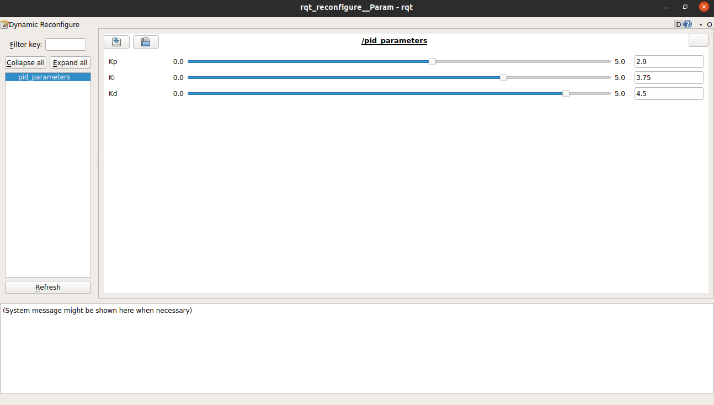

# README

- This package creates ROS Parameters named - `PID`
- These parameters can be accessed using GUI




## Build

1. Copy the following two package and paste it in the `vehicle/src/vehicle` directory:
   - `dynamic_reconfigure-noetic-devel`
   - `dynamic_parameters`
2. Build the workspace
   `~/vehicle/catkin_make`


---


## Test

To run and test the parameters, use the following commands

- `roslaunch dynamic_parameters pid_tuning.launch`

- Open a new terminal and check the available parameters using

  `rosparam list`

- Check the parameter values using:

  `rosparam get /PID`

You can change the parameters in the GUI and check the values using above commands


- To get the data in the code files, there are two methods:

  1. Using Client Node

     ```python
     #!/usr/bin/env python
     
     import rospy
     
     import dynamic_reconfigure.client
     
     def callback(config):
         rospy.loginfo("Config set to {int_param}, {double_param}, {str_param}, {bool_param}, {size}".format(**config))
     
     if __name__ == "__main__":
         rospy.init_node("dynamic_client")
     
         client = dynamic_reconfigure.client.Client("dynamic_tutorials", timeout=30, config_callback=callback)
     
         r = rospy.Rate(0.1)
         x = 0
         b = False
         while not rospy.is_shutdown():
             x = x+1
             if x>10:
                 x=0
             b = not b
             client.update_configuration({"int_param":x, "double_param":(1/(x+1)), "str_param":str(rospy.get_rostime()), "bool_param":b, "size":1})
             r.sleep()
     ```

     

  2. Using ROS Parameters

     - Create ROS parameters and update them as soon as value are changed in GUI

       ```python
       #!/usr/bin/env python
       
       import rospy
       
       from dynamic_reconfigure.server import Server
       from dynamic_parameters.cfg import pid_paramsConfig
       
       def callback(config, level):
           print("Kp = ", config.Kp, "\tKi = ", config.Ki, "\tKd = ", config.Kd)
           rospy.set_param('PID', [config.Kp, config.Ki, config.Kd])
       
           return config
       
       if __name__ == "__main__":
           rospy.init_node("pid_parameters", anonymous = False)   # Node name will appear in the GUI
       
           srv = Server(pid_paramsConfig, callback)
       
           rospy.spin()
       ```

     - Access these values in any node of your choice using the below code

       ```python
       gains = rospy.get_param('/PID')
       Kp = gains[0]
       Ki = gains[1]
       Kd = gains[2]
       print("Received values: ", Kp, Ki, Kd)
       ```

       

  

---


## Configure

To add more dynamic parameters, follow the below steps

1. Create a new file in the directory `~/vehicle/src/dynamic_parameters/cfg/` by copying `Template.cfg` from the same directory

2. Add the below code to the file

   ```python
   #!/usr/bin/env python
   PACKAGE = "dynamic_parameters"    # CHANGE HERE if the package name is changed
   
   from dynamic_reconfigure.parameter_generator_catkin import *
   
   gen = ParameterGenerator()
   
    # Change parameters as per the requirements
    """
   The add function adds a parameter to the list of parameters. It takes a few different arguments:
   	- name - a string which specifies the name under which this parameter should be stored
   	- paramtype - defines the type of value stored, and can be any of int_t, double_t, str_t, or bool_t
   	- level - A bitmask which will later be passed to the dynamic reconfigure callback. When the callback is called all of the level values for parameters that have been changed are ORed together and the resulting value is passed to the callback.
   	- description - string which describes the parameter
   	- default - specifies the default value
   	- min - specifies the min value (optional and does not apply to strings and bools)
   	- max - specifies the max value (optional and does not apply to strings and bools)
   """
   gen.add("int_param",    int_t,    0, "An Integer parameter", 50,  0, 100)
   gen.add("double_param", double_t, 0, "A double parameter",    .5, 0,   1)
   gen.add("str_param",    str_t,    0, "A string parameter",  "Hello World")
   gen.add("bool_param",   bool_t,   0, "A Boolean parameter",  True)
   
   size_enum = gen.enum([ gen.const("Small",      int_t, 0, "A small constant"),
                          gen.const("Medium",     int_t, 1, "A medium constant"),
                          gen.const("Large",      int_t, 2, "A large constant"),
                          gen.const("ExtraLarge", int_t, 3, "An extra large constant")],
                        "An enum to set size")
   
   gen.add("size", int_t, 0, "A size parameter which is edited via an enum", 1, 0, 3, edit_method=size_enum)
   
   exit(gen.generate(PACKAGE, "PID", "Template"))
   # CHANGE HERE if the package name is changed
   # Node name
   # config file name
   ```

   

3. Add the file to `CMakeLists.txt`

   ```xml
   ## Generate dynamic reconfigure parameters in the 'cfg' folder
   generate_dynamic_reconfigure_options(
      cfg/pid_params.cfg
      cfg/Template.cfg
   )
   ```

   

4. Build the package

5. To test the results, run the following nodes:

   - Roscore - `roscore`
   - Command - `rosrun rqt_gui rqt_gui -s reconfigure`
   - Command - `rosrun dynamic_parameters server.py`
   - Command - `rosrun dynamic_parameters server_template.py`